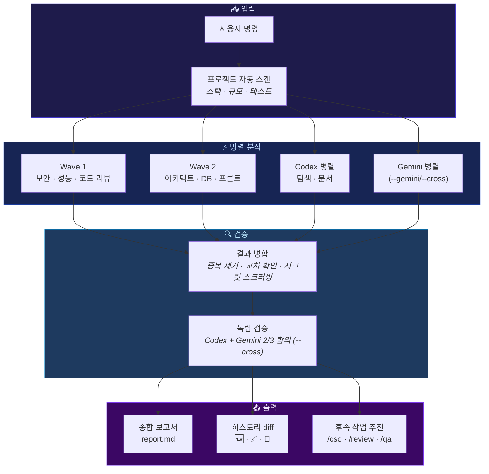

<div align="center">

# /team-agent

### AI Agent Team Orchestrator for Claude Code

[](#agent-roles-42)
[](#agent-roles-42)
[](#domain-coverage)
[](#hybrid-ai)

**하나의 명령으로 전문가 팀을 소환하세요.**

보안, 성능, 아키텍처, 게임 디자인, 퀀트 전략, DeFi 분석까지 —<br/>
병렬 에이전트 팀이 동시에 분석하고, 다른 AI가 독립 검증합니다.

```
/team-agent 보안 점검
```


</div>

---

## Why?

코드 리뷰를 한 관점에서만 하면 맹점이 생깁니다.

| | 기존 방식 | /team-agent |
|---|----------|-------------|
| **분석 인원** | 1명 순차 | 3~8명 병렬 |
| **관점** | 단일 | 보안 + 품질 + 성능 + 아키텍처 동시 |
| **검증** | 자기 검증 | Codex(GPT) · Gemini 독립 교차 검증 (최대 3중 합의) |
| **출력** | 텍스트 나열 | 구조화 JSON + 심각도 + 히스토리 diff |
| **도메인** | 범용만 | 게임 · 퀀트 · DeFi · 라이브옵스 등 |
| **언어** | 고정 | 감지된 스택별 동적 전문가 |

---

## Architecture



---

## Features

### Core
- **42+ 전문 역할** — 보안, 성능, 아키텍처부터 게임 디자인, 퀀트 전략, DeFi, RAG/벡터DB, GraphQL/gRPC까지
- **335+개 체크리스트** — 역할별 심층 분석 기준 (탐색 힌트 포함)
- **즉석 역할 생성** — 풀에 없는 도메인이면 최대 2개까지 커스텀 역할 자동 생성
- **동적 언어 전문가** — Go, Rust, Python, TypeScript, Java, Ruby, Swift, PHP, Elixir 자동 감지
- **공유 코드맵** — Phase 0.3에서 프로젝트 전역 코드맵을 1회 생성 후 전체 에이전트가 재활용 (Claude/Codex/Gemini 3 백엔드)
- **구조화 JSON 출력** — 파일, 줄 번호, 코드 조각, 근거, 확신도 포함
- **히스토리 diff** — 이전 실행과 자동 비교 (🆕 신규 / ✅ 해결 / 🔄 지속)
- **시크릿 자동 스크러빙** — 에이전트 출력에서 민감 패턴 기계적 redaction

### Hybrid AI
- **`--codex` 모드** — Claude + Codex(GPT) 하이브리드 팀
  - `hybrid` (기본): 정밀 분석 → Claude, 나머지 → Codex
  - `all`: 전원 Codex (비용 최소)
- **`--gemini` 모드** — Claude + Gemini 3.1 Flash-Lite 하이브리드 팀
  - `hybrid` (기본): 정밀 분석 → Claude, 탐색·문서 → Gemini (40-60% 절감)
  - `all`: 전원 Gemini (최저가, 정밀도 하락)
- **`--cross` 모드** — Claude + Codex + Gemini 3-way 팀 + 3중 독립 검증
  - 역할별로 3개 모델 자동 배분 (정밀=Claude, 구조=Codex, 탐색/문서=Gemini)
  - Phase 4-A-2에서 Codex·Gemini가 동시에 독립 검증 → 2/3 합의로 severity 확정
  - 불일치 시 `쟁점 항목(dispute)` 테이블에 명시
- **교차 검증** — 반증 시도 + 독립 분석 + 대조 검증 3단계
- **역검증 원칙** — Claude→Codex, Codex→Claude, Gemini→Claude 교차

### Workflow
| 플래그 | 설명 |
|--------|------|
| `--auto` | 질문 없이 즉시 실행 (CI/자동화용) |
| `--deep` | 에이전트 간 결과 통합 2차 라운드 |
| `--diff [base]` | 변경 파일만 분석 (PR 리뷰용, bounded incremental) |
| `--scope <path>` | 모노레포에서 특정 디렉토리만 분석 |
| `--resume <RUN_ID>` | 실패한 에이전트만 재실행 |
| `--codex [all\|hybrid]` | Claude+GPT 하이브리드 팀 (`--gemini`·`--cross`와 상호 배타) |
| `--gemini [all\|hybrid]` | Claude+Gemini 3.1 Flash-Lite 하이브리드 팀 (`--codex`·`--cross`와 상호 배타) |
| `--cross` | Claude+Codex+Gemini 3-way 팀 + 3중 독립 검증 |
| `--ultra` | 각 역할에 Claude+Codex+Gemini 3중 복제 + Phase 2.5 Opus 역할별 통합 (최고 정밀도, 3~4배 비용) |
| `--notify telegram` | 완료 시 텔레그램 알림 |
| `--dry-run` | 팀 구성/프롬프트만 미리보기 |
| `update` | 스킬 최신 버전으로 업데이트 |

> **`--cross` vs `--ultra`**: cross는 **분산**(역할별 서로 다른 모델) + 2/3 독립 검증. ultra는 **복제**(같은 역할을 3모델이 병렬) + 역할별 Opus 통합자가 3/3·2/3·1/3 합의와 모순 감지. 프로덕션 릴리스 감사처럼 최고 정밀도가 필요할 때 ultra, 비용 효율적 교차 검증이 필요할 때 cross.

---

## Install

```bash
# Claude Code에서 스킬 설치
claude install-skill https://github.com/ivelly42/team-agent-skill
```

또는 수동 설치:

<details>
<summary><b>macOS / Linux</b></summary>

```bash
git clone https://github.com/ivelly42/team-agent-skill.git \
  ~/.claude/skills/team-agent
```
</details>

<details>
<summary><b>Windows (PowerShell)</b></summary>

```powershell
git clone https://github.com/ivelly42/team-agent-skill.git `
  "$env:USERPROFILE\.claude\skills\team-agent"
```
</details>

<details>
<summary><b>Windows (CMD)</b></summary>

```cmd
git clone https://github.com/ivelly42/team-agent-skill.git ^
  "%USERPROFILE%\.claude\skills\team-agent"
```
</details>

### Requirements
- [Claude Code](https://claude.ai/claude-code) CLI
- (선택) [Codex CLI](https://github.com/openai/codex) — `--codex` 모드용

### Update
```
/team-agent update
```

---

## Usage

### 🛡️ 출시 전 보안 감사
```bash
/team-agent --codex 결제 시스템 보안 전수 점검
```
> 보안 감사 + 백엔드 아키텍트 + DB 전문가가 병렬 분석, Codex가 독립 검증

### 🚀 PR 머지 전 빠른 리뷰
```bash
/team-agent --diff main --auto 변경 사항 리뷰
```
> main 대비 변경 파일 + import 1-hop + 계약 파일만 bounded 분석

### 🎮 게임 프로젝트 라이브 점검
```bash
/team-agent --codex hybrid 시즌 업데이트 전 전체 점검
```
> 게임 이코노미 + 라이브옵스 + 게임 QA + 모네타이제이션 전문가 자동 투입

### 📈 퀀트 전략 코드 검증
```bash
/team-agent --deep 백테스트 파이프라인 및 리스크 모델 점검
```
> 퀀트 전략 + 리스크 관리 + 백테스트 전문가 + 2차 통합 라운드

### 🔗 DeFi 프로토콜 감사
```bash
/team-agent --codex 스마트 컨트랙트 보안 및 토크노믹스 분석
```
> 온체인 분석 + DeFi 분석 + 보안 감사가 동시 투입, GPT 교차 검증

### 🏗️ 모노레포 특정 서비스만
```bash
/team-agent --scope packages/api 백엔드 아키텍처 리뷰
```
> scope 내 파일만 분석하여 토큰 절감

### 🔄 기타
```bash
/team-agent --resume 2026-04-06-001534  # 실패 에이전트만 재실행
/team-agent --dry-run 성능 최적화       # 팀 구성 미리보기 (실행 안 함)
/team-agent --gemini 코드 리뷰             # Gemini 하이브리드
/team-agent --gemini all 보안 점검         # 전원 Gemini (최저가)
/team-agent --cross 전체 감사              # 3-way + 3중 검증
/team-agent --ultra 프로덕션 릴리스 감사    # 역할당 3중 복제 + Opus 역할별 통합 (최고 정밀도)
/team-agent update                      # 스킬 최신 버전으로 업데이트
```

---

## Agent Roles (42+)

> **v3 (2026-04)**: 역할 풀 확장 — AI/데이터 5개(#34-38), API/계약 4개(#39-42) 추가. 번호 재정렬로 `게임 디자이너`가 #18로, 기존 `데이터 파이프라인`은 #33으로 이동. 전체 역할 정의는 [SKILL.md Step 3-1](SKILL.md) 참조.

<table>
<tr>
<td colspan="2" align="center"><b>🔧 Software Engineering</b></td>
</tr>
<tr><td>

| # | 역할 | 체크리스트 |
|---|------|----------|
| 1 | 보안 감사 | OWASP, 인증, 시크릿, Rate limiting |
| 2 | {언어} 전문가 | 스택별 동적 생성 (9개 언어) |
| 3 | 백엔드 아키텍트 | 레이어, API, 서비스 경계, 이벤트 |
| 4 | 프론트엔드 | 컴포넌트, 상태, 접근성, 반응형 |
| 5 | DB 아키텍트 | 스키마, 인덱스, 마이그레이션, 쿼리 |
| 6 | 성능 엔지니어 | N+1, 캐싱, 번들, 메모리 누수 |
| 7 | AI/ML 엔지니어 | 프롬프트, 모델 통합, 평가, 가드레일 |
| 8 | 디버거 | 에러 패턴, 로그, 레이스 컨디션 |

</td><td>

| # | 역할 | 체크리스트 |
|---|------|----------|
| 9 | 클라우드 아키텍트 | IaC, 멀티 리전, 비용 |
| 10 | 배포 엔지니어 | CI/CD, 컨테이너, 롤백 |
| 11 | 문서 아키텍트 | API 문서, 온보딩, 아키텍처 |
| 12 | TDD 오케스트레이터 | 피라미드, 커버리지, CI |
| 13 | UI/UX 디자이너 | 사용성, 접근성, 디자인 일관성 |
| 14 | 장애 대응 전문가 | 분류, 모니터링, 복구, 포스트모템 |
| 15 | 코드 리뷰어 | DRY, 복잡도, 에러 처리, 타입 |
| 16 | 코드 탐색가 | 프로젝트 구조, 의존성 매핑 |
| 17 | 통합 정합성 (QA) | API↔훅, 경로↔링크, 상태전이 |

</td></tr>
<tr>
<td colspan="2" align="center"><b>🎮 Game Development</b></td>
</tr>
<tr><td colspan="2">

| # | 역할 | 초점 |
|---|------|------|
| 18 | 게임 디자이너 | 코어 루프, 밸런싱, 시스템 디자인, 온보딩 |
| 19 | 게임 QA | 치트 방지, 재현 경로, 에지 케이스, 네트코드 |
| 20 | 내러티브 디자이너 | 분기 구조, 로컬라이제이션, 컷신, 퀘스트 |
| 21 | 게임 이코노미스트 | 인게임 통화, 싱크/소스, 인플레이션, 시뮬레이션 |
| 22 | 모네타이제이션 | IAP, 배틀패스, 광고, 규제 컴플라이언스 |
| 23 | 라이브옵스 | 시즌, A/B 테스트, 이벤트 스케줄링, KPI |
| 24 | 유저 리서치/데이터 분석가 | 플레이테스트, 히트맵, 설문, 리텐션 |

</td></tr>
<tr>
<td colspan="2" align="center"><b>📈 Quantitative Finance & DeFi</b></td>
</tr>
<tr><td colspan="2">

| # | 역할 | 초점 |
|---|------|------|
| 25 | 퀀트 전략가 | 알파 팩터, 시그널, 포트폴리오 최적화, 거래 비용 |
| 26 | 트레이딩 시스템 엔지니어 | 주문 관리, 레이턴시, 마켓 커넥터, 장애 복구 |
| 27 | 리스크 매니저 | VaR, 포지션 한도, 마진, 스트레스 테스트 |
| 28 | 마켓 마이크로스트럭처 | 오더북, 스프레드, 슬리피지, 호가 분석 |
| 29 | 온체인 데이터 분석가 | 트랜잭션 추적, MEV, 가스 최적화, 컨트랙트 |
| 30 | DeFi 프로토콜 분석가 | TVL, IL, 풀 효율성, 프로토콜 리스크 |
| 31 | 백테스트/시뮬레이션 | 룩어헤드 바이어스, 슬리피지 모델, 몬테카를로 |
| 32 | 수학/통계 전문가 | 시계열, 확률 모형, 베이지안, 최적화 |
| 33 | 데이터 파이프라인 엔지니어 | ETL, 스키마 진화, 모니터링 |

</td></tr>
<tr>
<td colspan="2" align="center"><b>🤖 AI/데이터 (v3 신규)</b></td>
</tr>
<tr><td colspan="2">

| # | 역할 | 초점 |
|---|------|------|
| 34 | RAG 아키텍트 | 청킹 전략, 리트리버 방식, re-ranking, 할루시네이션 방어 |
| 35 | 벡터DB 전문가 | HNSW/IVF 튜닝, 메타데이터 필터, 업서트 패턴 |
| 36 | 프롬프트 엔지니어 | 버전 관리, Few-shot, 토큰 예산, 인젝션 방어 |
| 37 | 모델 평가 전문가 | eval 데이터셋, 자동/수동 평가, 회귀 감지 |
| 38 | 파인튜닝 전문가 | SFT/DPO/LoRA, 데이터 품질, 과적합 검출 |

</td></tr>
<tr>
<td colspan="2" align="center"><b>🔌 API/계약 (v3 신규)</b></td>
</tr>
<tr><td colspan="2">

| # | 역할 | 초점 |
|---|------|------|
| 39 | GraphQL 아키텍트 | 스키마 설계, N+1 해결, persisted query, 페이지네이션 |
| 40 | gRPC 엔지니어 | proto 버전 관리, streaming, deadline, 인터셉터 |
| 41 | OpenAPI 설계자 | REST 계약, 버전 관리, pagination, error envelope |
| 42 | 이벤트 드리븐 아키텍트 | 이벤트 스키마, 멱등성, DLQ, 재생 가능성 |

</td></tr>
<tr>
<td colspan="2" align="center"><b>✨ Ad-hoc (즉석 생성)</b></td>
</tr>
<tr><td colspan="2">

풀의 42개 역할로 커버 안 되는 도메인이면 **최대 2개**까지 즉석 역할을 자동 생성합니다.

```
예: "블록체인 브릿지 보안 전문가", "음성 AI 품질 엔지니어"
```

즉석 역할은 `[즉석]` 태그로 표시되며, 사용자가 제거 가능합니다.

</td></tr>
</table>

---

## Domain Coverage

| 도메인 | 역할 수 | 주요 전문 분야 |
|:------:|:-------:|--------------|
| **🔧 Software Engineering** | 17 | 보안 · 성능 · 아키텍처 · DB · 프론트엔드 · 테스트 · AI · 인프라 · 디버깅 · 통합 QA |
| **🎮 Game Development** | 7 | 게임 디자인 · QA · 내러티브 · 이코노미 · 모네타이제이션 · 라이브옵스 · 유저 리서치 |
| **📈 Quant & DeFi** | 9 | 퀀트 전략 · 트레이딩 · 리스크 · 마이크로스트럭처 · 온체인 · DeFi · 백테스트 · 수학/통계 · 데이터 파이프라인 |
| **🤖 AI/데이터** | 5 | RAG · 벡터DB · 프롬프트 엔지니어링 · 모델 평가 · 파인튜닝 |
| **🔌 API/계약** | 4 | GraphQL · gRPC · OpenAPI/REST · 이벤트 드리븐 |
| **✨ Ad-hoc** | +2 | 풀에 없는 도메인은 즉석 생성 (예: 블록체인 브릿지 보안, 음성 AI 품질) |

---

## How It Works

```
 사용자                    SKILL 엔진                  Agent 팀                 Codex 검증
   │                          │                          │                         │
   │  /team-agent 보안 점검   │                          │                         │
   │─────────────────────────▶│                          │                         │
   │                          │  프로젝트 스캔            │                         │
   │                          │  (스택·규모·테스트)       │                         │
   │                          │                          │                         │
   │  팀 추천 (5명) — 승인?   │                          │                         │
   │◁─────────────────────────│                          │                         │
   │  확인                    │                          │                         │
   │─────────────────────────▶│                          │                         │
   │                          │  Wave 1 (3명) 병렬       │                         │
   │                          │─────────────────────────▶│                         │
   │                          │  Wave 2 + Codex 병렬     │                         │
   │                          │─────────────────────────▶│                         │
   │                          │                          │                         │
   │                          │  JSON 결과 수집           │                         │
   │                          │◁─────────────────────────│                         │
   │                          │                          │                         │
   │                          │  병합 + 시크릿 스크러빙   │                         │
   │                          │                          │                         │
   │                          │  반증 시도 + 독립 분석    │                         │
   │                          │─────────────────────────────────────────────────▶│
   │                          │  검증/이의/추가 발견      │                         │
   │                          │◁────────────────────────────────────────────────│
   │                          │                          │                         │
   │  종합 보고서 + 채팅 요약 │                          │                         │
   │◁─────────────────────────│                          │                         │
```

---

## Output

### Chat Summary
```
━━━━━━━━━━━━━━━━━━━━━━━━━━━━━━━━━━━━
  팀 에이전트 결과 요약
━━━━━━━━━━━━━━━━━━━━━━━━━━━━━━━━━━━━

### 개선 필요 항목
| # | 변화 | 심각도 | 항목        | 동의 | Codex |
|---|------|--------|------------|------|-------|
| 1 | 🆕   | High   | SQL 인젝션  | 3명  | ✅    |
| 2 | 🔄   | Medium | 캐싱 미적용 | 2명  | ✅    |

### Codex 검증 쟁점
| # | 항목        | Claude 원본 근거   | Codex 반론        |
|---|------------|-------------------|-------------------|
| 1 | 토큰 만료   | 검증 로직 미구현    | 프레임워크 자동 처리 |

### 해결된 항목 (이전 실행 대비)
| # | 항목       | 이전 심각도 |
|---|-----------|-----------|
| 1 | XSS 취약점 | High      |
━━━━━━━━━━━━━━━━━━━━━━━━━━━━━━━━━━━━
```

### Generated Files
```
docs/team-agent/
├── {RUN_ID}-{slug}-report.md      # 상세 보고서
├── {RUN_ID}-{slug}-handoff.md     # 다른 AI 전달용 요약
├── {RUN_ID}-codemap.json          # 공유 코드맵 (Phase 0.3에서 생성, 전 에이전트 재활용)
├── .runs/{RUN_ID}.json            # 실행 manifest (schema v4)
└── .history.jsonl                 # 실행 히스토리 (append-only)
```

---

## File Structure

```
team-agent/
├── SKILL.md                                # 스킬 본체 (프롬프트 + 실행 로직)
├── README.md                               # 이 파일
├── CLAUDE.md                               # 프로젝트 메타
├── refs/
│   ├── checklists.md                       # 42개 역할 × 335+개 체크리스트
│   ├── codemap-generator.md                # 공유 코드맵 생성 프롬프트 (Phase 0.3)
│   ├── codemap-schema.json                 # 공유 코드맵 JSON Schema
│   ├── codex-agent-template.md             # Codex 에이전트 탐색 지시
│   ├── codex-verification.md               # Codex 독립 검증 절차
│   ├── cross-verification.md               # 3중 검증 합의 알고리즘 (--cross 모드)
│   ├── cross-verification-schema.json      # 3중 검증 verdict 스키마
│   ├── gemini-agent-template.md            # Gemini 에이전트 탐색 지시
│   ├── gemini-verification.md              # Gemini 역검증 절차 (--gemini 단독)
│   ├── integration-qa.md                   # 통합 QA 에이전트 체크리스트
│   ├── output-schema.json                  # 에이전트 출력 JSON Schema
│   └── verification-schema.json            # Codex 검증 구조화 JSON Schema
└── docs/team-agent/                        # 실행 결과 (권장: .gitignore)
    ├── {RUN_ID}-codemap.json               # 공유 코드맵 (Phase 0.3 산출)
    ├── .runs/                              # manifest 저장소 (schema v4)
    └── .history.jsonl                      # 히스토리
```

---

## Security

이 스킬은 **임의 저장소를 분석**하도록 설계되었으므로 다층 보안이 적용되어 있습니다:

| 보안 계층 | 설명 |
|----------|------|
| **입력 sanitizer** | TASK_PURPOSE · PROJECT_CONTEXT 모두에 제어문자/구분자 제거 |
| **Write 도구 패턴** | 사용자 입력은 셸을 거치지 않고 파일→Python 경로로만 전달 |
| **에이전트 격리** | `bypassPermissions` 모드에서 git worktree 파일시스템 격리 |
| **시크릿 보호** | API 키/토큰은 `[REDACTED]`로 자동 치환 (프롬프트 + 기계적 이중 방어) |
| **Scope 검증** | `--scope` 경로 순회 공격 방지 (`realpath` 검증) |
| **Resume 재정제** | manifest 복원 시 sanitizer 재적용 (변조 방어) |
| **.gitignore 안내** | manifest에 프로젝트 구조 포함 → 공개 저장소 노출 방지 |

---

## Cost Model

```
예상 토큰: 총 ~150K (낙관 ~105K / 기대 ~150K / 비관 ~225K)

  보안 감사 [Claude]:    ~45K  (정밀 ×1.5)
  백엔드 아키텍트 [Codex]: ~75K  (구조 ×1.0 + Codex 오버헤드 45K)
  문서 아키텍트 [Codex]:  ~56K  (문서 ×0.7 + Codex 오버헤드 45K)
```

| 모드 | 에이전트 | 토큰 | 시간 | 비용 (기본 대비) |
|------|---------|------|------|------|
| 기본 (5명, Claude only) | 5 | ~150K | 3-5분 | ~$1-2 (기준) |
| `--deep` | 6 | ~200K | 5-8분 | ~$1.5-3 |
| `--codex hybrid` | 5 | ~250K | 4-7분 | ~$1.5-2.5 |
| `--codex all` | 5 | ~280K | 4-6분 | ~60-75% 절감 (정밀도 하락) |
| `--gemini hybrid` | 5 | ~200K | 3-6분 | ~40-60% 절감 (탐색·문서 Gemini 위임) |
| `--gemini all` | 5 | ~230K | 3-5분 | ~70-85% 절감 (최저가, 정밀도 하락) |
| `--cross` | 5 | ~400K | 5-9분 | ~1.3-1.8배 (3-way + 3중 검증, 최고 정확도) |

---

## License

MIT

---

<div align="center">
<br/>

**Built with Claude Code + Codex + Gemini 3-way orchestration**

*"한 명보다 팀이 낫고, 한 모델보다 교차 검증이 낫다."*

<br/>

[Install](#install) · [Usage](#usage) · [Roles](#agent-roles-42) · [Security](#security)

</div>
