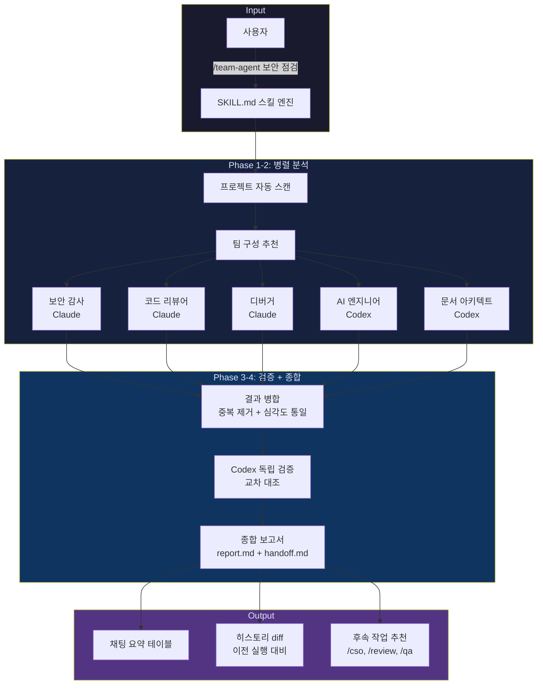
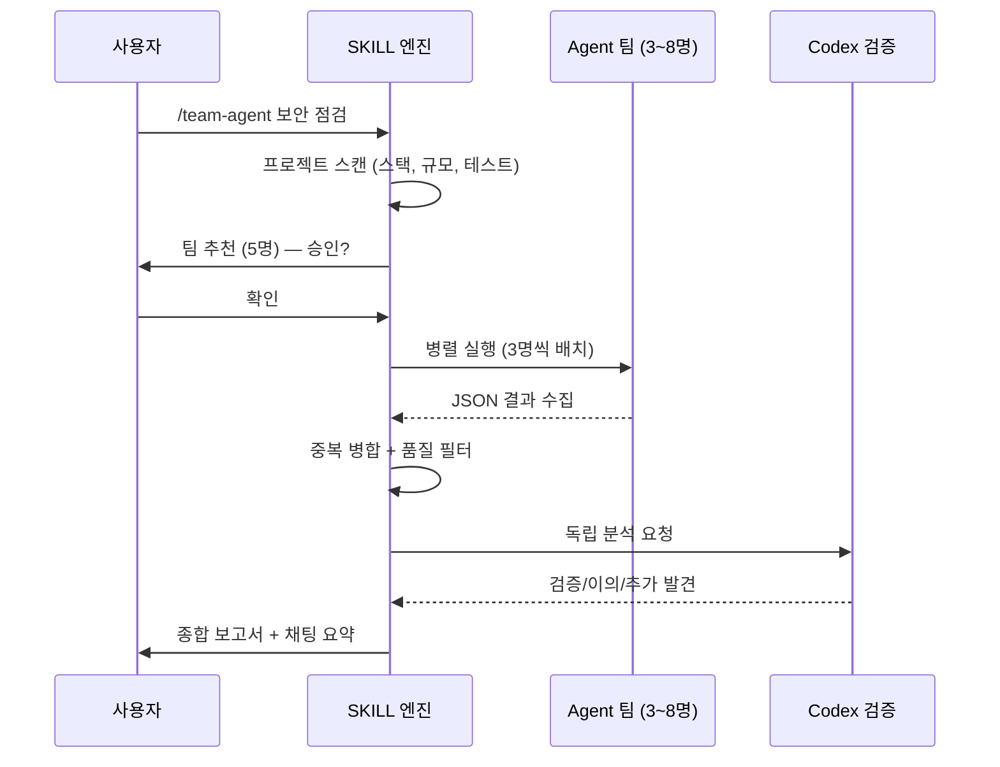

# /team-agent — AI Agent Team Orchestrator for Claude Code

> **하나의 명령으로 전문가 팀을 소환하세요.**
> 보안 감사, 코드 리뷰, 성능 분석, 아키텍처 검토를 병렬 에이전트 팀이 동시에 수행합니다.

```
/team-agent 보안 점검
```

5명의 전문 에이전트가 프로젝트를 분석하고, Codex(GPT)가 독립 검증하고, 종합 보고서를 생성합니다.

---

## Why?

코드 리뷰를 한 관점에서만 하면 맹점이 생깁니다.

| 기존 방식 | /team-agent |
|----------|-------------|
| 1명이 순차 분석 | 3~8명 병렬 분석 |
| 한 관점 | 보안 + 품질 + 성능 + 아키텍처 동시 |
| 자기 검증 | Codex(GPT) 독립 교차 검증 |
| 텍스트 나열 | 구조화 JSON + 심각도 분류 + 히스토리 diff |

---

## Architecture



---

## Features

### Core
- **자동 팀 구성** — 프로젝트 스택/규모를 분석하여 3~8명의 최적 팀을 추천
- **18개 전문 역할** — 보안, 성능, 아키텍처, 프론트엔드, DB, AI/ML, 디버깅 등
- **구조화 JSON 출력** — 모든 발견 사항에 파일, 줄 번호, 코드 조각, 근거 포함
- **히스토리 diff** — 이전 실행과 자동 비교 (신규/해결/지속 표시)

### Hybrid AI
- **`--codex` 모드** — Claude + Codex(GPT) 하이브리드 팀 구성
  - `hybrid` (기본): 정밀 분석 → Claude, 나머지 → Codex
  - `all`: 전원 Codex (비용 최소)
- **교차 검증** — 팀 결과를 다른 AI 모델이 독립 분석 후 대조

### Workflow
- **`--auto`** — 질문 없이 즉시 실행 (CI/자동화용)
- **`--deep`** — 에이전트 간 결과 통합 2차 라운드
- **`--scope <path>`** — 모노레포에서 특정 디렉토리만 분석
- **`--resume <RUN_ID>`** — 실패한 에이전트만 재실행
- **`--notify telegram`** — 완료 시 텔레그램 알림
- **`--dry-run`** — 에이전트 없이 팀 구성/프롬프트만 미리보기

---

## Install

```bash
# Claude Code에서 스킬 설치
claude install-skill https://github.com/ivelly42/team-agent-skill
```

또는 수동 설치:
```bash
git clone https://github.com/ivelly42/team-agent-skill.git \
  ~/.claude/skills/team-agent
```

PowerShell 설치
```bash
New-Item -ItemType Directory -Force -Path "$HOME\.claude\skills" | Out-Null
git clone https://github.com/ivelly42/team-agent-skill.git "$HOME\.claude\skills\team-agent"
```


### Requirements
- [Claude Code](https://claude.ai/claude-code) CLI
- (선택) [Codex CLI](https://github.com/openai/codex) — `--codex` 모드용

---

## Usage

```bash
# 기본 — 대화형으로 팀 구성 후 실행
/team-agent 보안 점검

# 자동 모드 — 즉시 실행
/team-agent --auto 코드 리팩토링

# Codex 하이브리드 — Claude+GPT 교차 분석
/team-agent --codex 전체 점검

# 모노레포 — 특정 패키지만
/team-agent --scope packages/api 백엔드 점검

# 심층 분석 — 2차 통합 라운드
/team-agent --deep 성능 최적화

# 실패 복구 — 이전 실행의 실패 에이전트만 재실행
/team-agent --resume 2026-04-06-001534
```

---

## How It Works



### Agent Role Pool (18 roles)

| Category | Roles |
|----------|-------|
| Security | 보안 감사 |
| Language | Python 전문가, TypeScript 전문가 |
| Architecture | 백엔드 아키텍트, 클라우드 아키텍트 |
| Development | 프론트엔드 개발자 |
| Data | DB 아키텍트 |
| Performance | 성능 엔지니어 |
| AI | AI/ML 엔지니어 |
| Debugging | 디버거 |
| Infrastructure | 배포 엔지니어 |
| Documentation | 문서 아키텍트 |
| Testing | TDD 오케스트레이터 |
| Design | UI/UX 디자이너 |
| Operations | 장애 대응 전문가 |
| Quality | 코드 리뷰어 |
| Analysis | 코드 탐색가 |
| QA | 통합 정합성 검증 |

---

## Output

### Chat Summary
```
━━━━━━━━━━━━━━━━━━━━━━━━━━━━━━━━━━━━
  팀 에이전트 결과 요약
━━━━━━━━━━━━━━━━━━━━━━━━━━━━━━━━━━━━

### 개선 필요 항목
| # | 변화 | 심각도 | 항목 | 동의 | Codex |
|---|------|--------|------|------|-------|
| 1 | 🆕  | High   | SQL 인젝션 가능성 | 3명 | ✅ |
| 2 | 🔄  | Medium | 캐싱 미적용 | 2명 | ✅ |

### 해결된 항목 (이전 실행 대비)
| # | 항목 | 이전 심각도 |
|---|------|-----------|
| 1 | XSS 취약점 | High |
```

### Files Generated
```
docs/team-agent/
  {RUN_ID}-{slug}-report.md    # 상세 보고서
  {RUN_ID}-{slug}-handoff.md   # 다른 AI 전달용 요약
  .runs/{RUN_ID}.json          # 실행 manifest
  .history.jsonl               # 실행 히스토리 (append-only)
```

---

## File Structure

```
team-agent/
├── SKILL.md                        # 스킬 본체 (프롬프트 + 실행 로직)
├── CLAUDE.md                       # 프로젝트 메타
├── refs/
│   ├── checklists.md               # 18개 역할별 분석 체크리스트
│   ├── output-schema.json          # 에이전트 출력 JSON 스키마
│   ├── codex-verification.md       # Codex 독립 검증 절차
│   ├── codex-agent-template.md     # Codex 에이전트 탐색 지시
│   └── integration-qa.md           # 통합 정합성 검증 체크리스트
└── docs/team-agent/                # 실행 결과 (gitignored)
    ├── .runs/                      # manifest 저장소
    └── .history.jsonl              # 히스토리
```

---

## Security

이 스킬은 **임의 저장소를 분석**하도록 설계되었으므로 다음 보안 조치가 적용되어 있습니다:

- **입력 sanitizer** — TASK_PURPOSE와 PROJECT_CONTEXT 모두에 구분자/제어문자 제거 적용
- **Write 도구 패턴** — 사용자 입력은 셸을 거치지 않고 파일로 저장 후 Python에서 로드
- **에이전트 격리** — `bypassPermissions` 모드에서 git worktree로 파일시스템 격리
- **시크릿 보호** — API 키, 토큰 등은 code_snippet에서 `[REDACTED]`로 대체
- **Scope 검증** — `--scope` 경로 순회 공격 방지 (realpath 검증)

---

## License

MIT

---

<p align="center">
  Built with Claude Code + Codex hybrid orchestration<br/>
  <em>"한 명보다 팀이 낫고, 한 모델보다 교차 검증이 낫다."</em>
</p>
